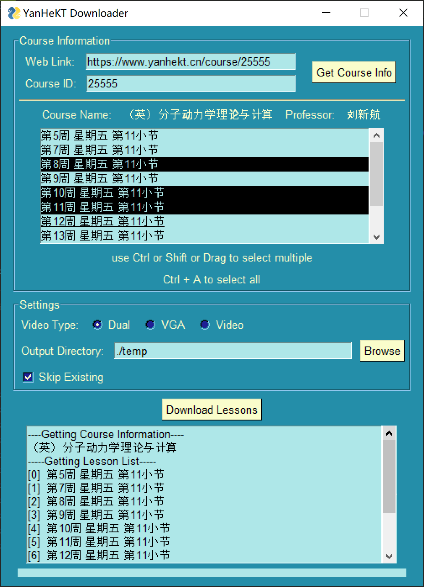

# 北理工延河课堂视频下载

欢迎Star🌟！欢迎提Issue

本项目在 网协2023“十行代码”比赛 荣获**特等奖**🎉 指路👉[Github](https://github.com/BITNP/poems-2023/)

## 功能介绍

下载[延河课堂](https://www.yanhekt.cn/)的录播视频

- 支持下载非选课班级的课程
- 支持多线程批量下载
- 支持下载电脑视频或教室录像
- 按课程名分类文件夹保存

## 更新日志

- 2023-4-10 同步延河课堂接口更改
- 2023-4-20 更改js执行方式，无需安装nodejs
- 2023-11-12 签名效率优化，优化下载速度
   - 理论可以跑满千兆有线网，可以根据电脑性能修改max_workers数量
- **2024-4-2 (🌟)更改signature实现方式**
   - 放弃js执行，不再使用js2py，提升兼容性 [issue#5](https://github.com/GDDG08/YanHeKT_Downloader/issues/5)
   - 现在时间sign和url后缀 都是py原生
- 2024-4-2 (🌟)更改交互方式，添加完整的**命令行参数**
   - 支持一次下载全部课时，感谢@ZJC-GH同学的建议和pr
   - 支持分别或同时下载VGA和Video
   - 支持增量下载，自动跳过已下载文件
   - 更改临时文件存储位置，放在`temp`中
   - 可以自定义输出文件夹位置
   - **详见 #食用方法**
   - 优化ffmpeg输出
- 2024-4-3 (🌟🌟)添加了GUI交互界面
   - 基于PySimpleGUI4，可以跨平台运行

## 使用前准备

### 方法〇：Windows发行（推荐）

- 下载 [Releases](https://github.com/GDDG08/YanHeKT_Downloader/releases/latest)中的exe文件
  - 建议下载带有ffmpeg版本，如`yanhekt-x.x.x-gui-ffmpeg.exe`
- 直接运行，略过后边的部分

### 方法一：现已通过Pypi发布

https://pypi.org/project/yanhekt/

- 安装`yanhekt`

    ```shell
    pip install yanhekt
    ```

- **确保命令行环境有ffmpeg**
  - 相关安装请自行搜索
    - Windows下载后，添加环境变量即可
  - 如果最终视频没有合并，说明ffmpeg环境存在问题

### 方法二：使用源代码

1. 下载/克隆本仓库或下载 [Releases](https://github.com/GDDG08/YanHeKT_Downloader/releases/latest)

2. 安装python依赖包

   ```shell
   pip install -r requirements.txt
   # (其实就一个requests)
   ```

3. **确保命令行环境（或者代码文件夹内）有ffmpeg**

   - 本仓库的release附带了ffmpeg(仅exe)
   - 相关安装请自行搜索
     - Windows简单的方法：下载后拷贝到代码文件夹内

   - 如果最终视频没有合并，说明ffmpeg环境存在问题

## 食用方法（GUI）

1. 开启方法

   0. 若release exe，直接打开

   1. 若使用pip安装

      ```shell
      yanhekt-gui
      yanhekt gui
      ```

   2. 若源码运行

      ```shell
      python main.py gui
      ```

2. 开箱即食

   

   - 扔进链接或者courseID（可Ctrl-C V）
   - 获取课程信息
   - 随意选择课时（Ctrl、Shift、鼠标拖拽都可多选）
   - 设置一些参数，比如要下载什么视频
   - 开下！


## 食用方法（命令行）

***注意：如果使用[本地源代码](#方法二：使用源代码)安装，请将本节中的`yanhekt`或`yanhekt-cli`替换为`python main.py`***

1. 获取课程ID

   在课程详情页，**注意不是视频播放页**，如`https://www.yanhekt.cn/course/11111`，

   从url中获得课程id，如`11111`

2. 命令行参数

   - **指定课程的ID**

     - `<courseID>`，直接给出

       ```shell
       # 例：查看课程信息及视频列表
       yanhekt 11111
       ```

   - **选择下载的课时序号**

     - `--all`，下载全部课时
     - `--list 0 2 4 `，下载选定的课时列表
     - `--range 3 5`，下载一个范围内的课时
       ```shell
       # 例：下载第3-8节课
       yanhekt 11111 --range 3 9
       yanhekt 11111 -L 3 9
       ```

   - **选择下载的视频类型**

     - `--dual`，同时下载电脑录屏和教室视频**（默认）**
     - `--vga `，仅下载电脑录屏
     - `--video`，仅下载教室视频
       ```shell
       # 例：下载第3-8节课，仅下载电脑录屏
       yanhekt 11111 --range 3 9 --vga
       ```

   - 增量下载

     - `--skip`，跳过已下载，仅下载新上传的视频
       ```shell
       # 例：定期更新课程全部视频
       yanhekt 11111 --all --skip
       ```

3. 更多高级用法请参考命令行提示

   ```shell
   !yanhekt --help
   
   # usage: main.py [-h] [-A | -L i [i ...] | -R i i] [-D | -G | -V] [-S] [--dir DIR] [--max-workers num] courseID
   
   # GDDG08/YanHeKT_Downloader
   
   # positional arguments:
   # courseID              Course ID of YanHeKT
   
   # options:
   # -h, --help            show this help message and exit
   
   # Lesson Selection:
   # IF NONE, PRINT LESSON LIST AND EXIT.
   
   # -A, --all             Download all lessons
   # -L i [i ...], --list i [i ...]
   #                         Select of lesson index (e.g., --list 1 2 4)
   # -R i i, --range i i   Select range of lessons (e.g., --range 3 5 for [3,5))
   
   # Video Type:
   # -D, --dual            Download both VGA(PC) and Video (default)
   # -G, --vga             Download VGA(PC) only
   # -V, --video           Download Video only
   
   # Configurations:
   # -S, --skip            Skip existing files
   # --dir DIR             Output directory (e.g., --dir ./output)
   # --max-workers num     Max workers for downloading (default: 32)
   
   ```

4. **ENJOY !**


## 作为python包使用

仍处于初期开发阶段，欢迎提功能需求和PR

```python
from yanhekt import YanHeKT

yanhekt = YanHeKT(25555, _all=True, _dual=True, _skip=True, _dir='./')
yanhekt.download()
```


## Todo（画大饼）

- ~~@ZJC-GH 同学添加了批量下载功能~~
   - ~~有需要的同学可以到[这个仓库](https://github.com/ZJC-GH/YanHeKT_Downloader) release中下载使用~~
   - ~~目前已合并到dev分支~~
- ~~计划使用`argparse`完善命令行参数，优化下交互体验~~(2.2.0已实现)
- ~~（超大饼）在参数写完后整个简单的gui~~


## 致谢

- [M3u8Download](https://github.com/anwenzen/M3u8Download)
